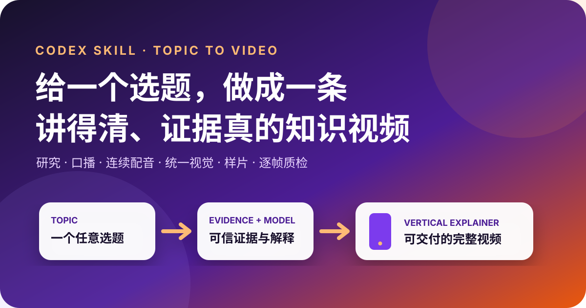

<div align="center">
  
</div>

# Produce Topic Explainer Video

给一个任意选题，从事实核验、口播与配音一路推进到统一视觉、代表性样片和成片质检。

[](./SKILL.md)
[](./LICENSE)
[](./CHANGELOG.md)

> 它复用的是一套完整的知识型短视频制作方法，不复制作者的私有生产项目、品牌角色、账号、素材或具体镜头。

[English overview](./README.en.md)

## 适合什么

- 科技、商业、效率、职场、产品与社会现象解读
- 从一句选题开始制作知识型竖屏视频
- 已有选题的研究、脚本、视觉计划或成片质量诊断
- 需要“人物 + 证据 + 模型”共同解释问题的视频

如果首要目标是让学习者完成明确的理解与迁移检验，请使用独立的教学视频 Skill；如果目标是从现成视频提取内嵌字幕截图，请使用小红书原生字幕 Skill。

## 输入与产物

最少只需一个清晰选题。也可补充角度、受众、平台、时长、必讲点、禁用说法、品牌、出镜者与声音。

| 阶段 | 主要产物 |
| --- | --- |
| 研究 | 选题承诺、事实来源、可推断边界和待补素材 |
| 脚本 | 口语化连续口播、行动结尾和结构说明 |
| 音频 | 连续配音、真实时间轴和字幕对齐 |
| 视觉 | 人物、证据、模型的统一视觉世界与镜头计划 |
| 验证 | 不超过 60 秒的代表性样片及批准记录 |
| 交付 | 成片、字幕、来源与质检记录、偏差和回滚说明 |

## 方法一览


开头快速提出问题、冲突或反差，并尽早给出有用答案。中段每一节都必须增加证据、模型关系或实际后果；结尾给出可执行动作、决策规则或精确的下一问题。

## 一分钟开始

### 1. 安装

```bash
git clone https://github.com/rui8001/produce-topic-explainer-video.git \
  ~/.codex/skills/produce-topic-explainer-video
```

也可以克隆到某个项目的 `.agents/skills/produce-topic-explainer-video/`，让 Skill 随项目维护。

### 2. 调用

```text
$produce-topic-explainer-video 为什么“本地优先”软件重新流行？做成一条 90 秒知识视频。
```

或直接说：

```text
把“AI 搜索为什么需要给来源”做成一条面向普通用户的竖屏解释视频。
```

### 3. 看公开示例

[“本地优先”完整规划示例](./examples/local-first/README.md) 展示从简报到来源核验、口播、视觉计划、生产状态和 QC 记录的过程；音频与成片阶段明确保留为待完成。

## Skill 如何工作

1. 把选题压缩为“观众看完能回答什么、做什么”的具体承诺。
2. 核验影响承诺的事实，记录来源和可推断边界；缺素材标记为 `needs_asset`。
3. 写成真实口播，而不是文章式章节或“首先、其次、最后”的模板。
4. 接受一整段连续音频后生成时间线，并按语义短语规划镜头。
5. 用 `persona / evidence / model` 三类角色构成同一个视觉世界。
6. 先制作覆盖真实角色与转场的代表性样片，记录批准后再完成全片。
7. 检查全部帧、字幕边界、转场、来源、版权、隐私和交付规格。

详细规则见：

- [从选题到脚本](./references/topic-to-script.md)
- [视觉方法](./references/visual-method.md)
- [生产流程](./references/production-workflow.md)
- [质量检查](./references/qc.md)
- [产物约定](./references/artifacts.md)

## 与教学视频 Skill 的区别

|  | 本仓库 | 教学视频 |
| --- | --- | --- |
| 核心成功标准 | 解释清楚问题并帮助观众判断或行动 | 学习者能理解、解释并迁移 |
| 常见起点 | 一个选题、冲突或现象 | 一个学习目标与常见误解 |
| 典型结尾 | 行动、决策规则或下一问题 | 迁移任务或理解检验 |
| 是否包含品牌表达 | 可以，但必须与事实和证据分离 | 通常以教学效果优先 |

## 仓库结构

```text
produce-topic-explainer-video/
├── SKILL.md
├── agents/openai.yaml
├── references/
├── examples/
├── assets/
├── README.md
└── CHANGELOG.md
```

## 安全边界

仓库不包含作者的真实客户、私有项目、品牌角色、账号、Cookie、API Key、配音样本、付费素材或最终成片。生成界面、数据、引语和案例不能冒充真实证据。安装 Skill 不代表授权访问账号、购买服务或公开发布内容。

详见 [SECURITY.md](./SECURITY.md) 与 [CONTRIBUTING.md](./CONTRIBUTING.md)。

## Roadmap

- 增加科技、商业和社会议题的脱敏公开示例
- 增加可选的选题简报、来源台账和镜头计划 JSON Schema
- 增加不同视频框架的实现参考
- 增加匿名化样片评审案例

## License

[MIT](./LICENSE) © 2026 rui8001
